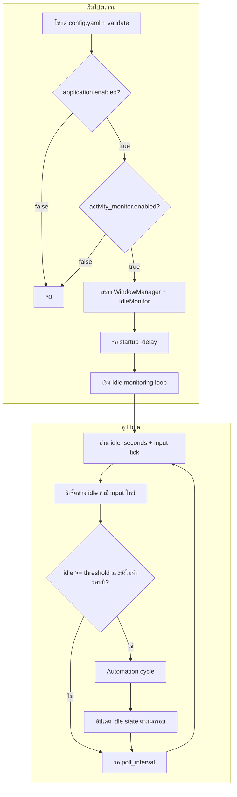
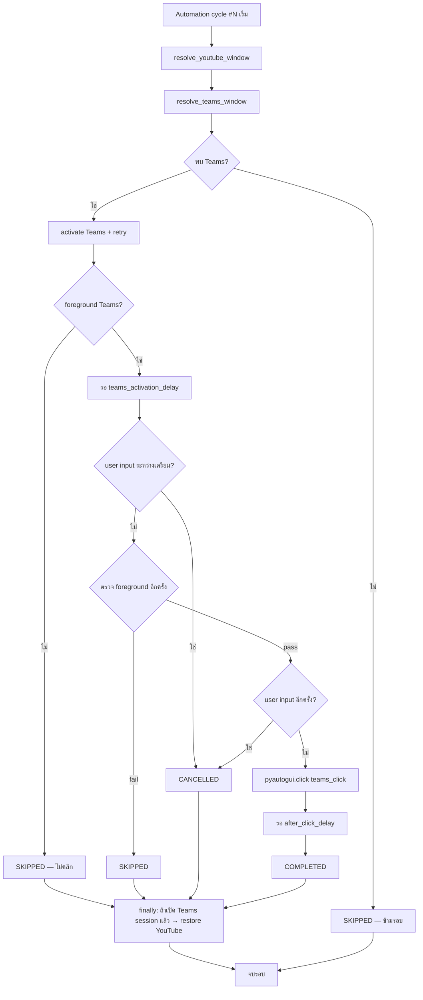
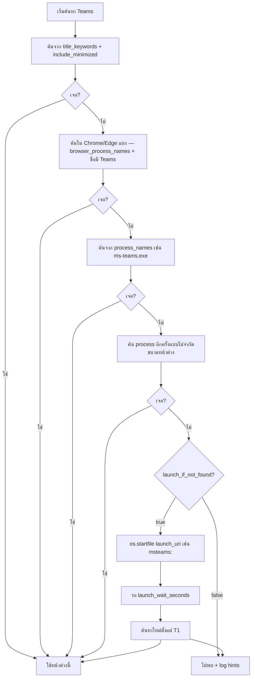
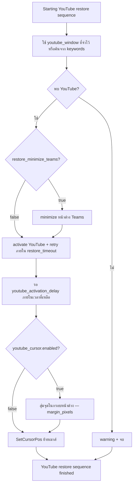
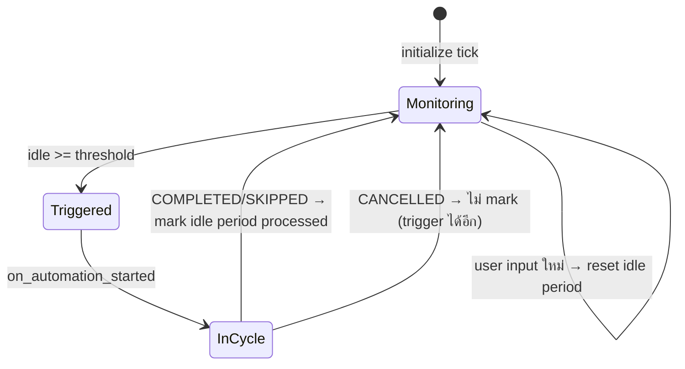

# YouTube Teams Auto Switch

แอปพลิเคชัน Python บน **Microsoft Windows** ที่ตรวจจับเวลา **Idle** ของผู้ใช้ (คีย์บอร์ด/เมาส์) แล้วรันรอบ automation:

1. จำหน้าต่าง **YouTube** ที่ผู้ใช้กำลังดู
2. หา/เปิด **Microsoft Teams** แล้วสลับไปหน้าต่าง Teams
3. **คลิกเมาส์** หนึ่งครั้งที่พิกัดที่ตั้งใน config
4. **สลับกลับ YouTube** (ใน `finally` หลังเปิด Teams สำเร็จ) และ **สุ่มตำแหน่งเมาส์** ในหน้าต่าง YouTube

โปรแกรมรันแบบวนลูปจนกว่าผู้ใช้กด `Ctrl+C`

---

## ความต้องการของระบบ

| รายการ | รายละเอียด |
|--------|------------|
| OS | Windows 10/11 |
| Python | 3.10+ |
| YouTube | หน้าต่างเบราว์เซอร์ที่ชื่อมี keyword ใน config (เช่น `YouTube`, `Chrome`) |
| Teams | **แอป Microsoft Teams Desktop** หรือหน้าต่าง Chrome/Edge **แยก** ที่ชื่อมี `Teams` |

### ข้อจำกัดสำคัญ (Teams)

ถ้า Teams เป็น **แท็บใน Chrome หน้าต่างเดียวกับ YouTube** ชื่อหน้าต่างจะเป็นชื่อแท็บ YouTube — โปรแกรม **มองไม่เห็น Teams**

**ทางแก้ (เลือกอย่างใดอย่างหนึ่ง):**

- ติดตั้งและเปิด **Teams Desktop** (`ms-teams.exe`) — ค่าเริ่มต้นจะลองเปิด `msteams:` ให้ถ้ายังไม่เจอหน้าต่าง
- หรือ **Pop out** Teams เป็นหน้าต่างเบราว์เซอร์ใหม่ (ชื่อหน้าต่างต้องมีคำว่า `Teams`)

---

## ติดตั้ง

```bash
python -m venv .venv
.venv\Scripts\activate
pip install -r requirements.txt
```

## การรัน

```bash
python main.py
```

- คอนฟิกเริ่มต้น: `config.yaml` (หรือ `--config path/to/config.yaml`)
- ดูพิกัดเมาส์เพื่อตั้ง `teams_click`:

```bash
python main.py --show-mouse-position
```

- หยุดโปรแกรม: `Ctrl+C`
- Log ไฟล์: `logs/app.log` (ถ้าเปิดใน config)

---

## Flow ภาพรวม



---

## Flow: Automation cycle (หนึ่งรอบ)



### ลำดับขั้นตอน (ตรงกับโค้ด)

| ขั้น | การทำงาน |
|------|----------|
| 1 | **YouTube** — `resolve_youtube_window`: ถ้า foreground ตรง keyword ใช้ handle นั้น ไม่เช่นนั้นค้นจาก `windows.youtube.title_keywords` |
| 2 | **Teams** — `resolve_teams_window` (ดู flow ย่อยด้านล่าง) ไม่ใช้ handle เดียวกับ YouTube |
| 3 | ถ้าไม่พบ Teams → `SKIPPED` (ไม่เข้า `finally` restore) |
| 4 | **เปิด Teams** — `activate_window_with_retries` (ShowWindow → BringWindowToTop → SetForegroundWindow + Alt fallback) |
| 5 | ถ้าเปิด Teams ไม่สำเร็จ → `SKIPPED` |
| 6 | ตั้ง `teams_session_active = true` — จากจุดนี้ `finally` จะพยายามกลับ YouTube เสมอ |
| 7 | รอ `teams_activation_delay_seconds` |
| 8 | ตรวจ **user activity** ตั้งแต่เริ่มรอบ (tick จาก `GetLastInputInfo`) — มีแล้ว → `CANCELLED` |
| 9 | ตรวจ **Teams เป็น foreground** (HWND / root / PID เดียวกัน) — ไม่ผ่าน → `SKIPPED` |
| 10 | ตรวจ user activity อีกครั้ง |
| 11 | **คลิก** `teams_click` ด้วย PyAutoGUI |
| 12 | รอ `after_click_delay_seconds` → `COMPLETED` |
| 13 | **`finally`** — ถ้า `teams_session_active` → `_switch_back_to_youtube` |

### ผลลัพธ์รอบ (CycleResult)

| ผล | ความหมาย | กลับ YouTube ใน finally? | Idle รอบนี้ |
|----|----------|---------------------------|-------------|
| `COMPLETED` | คลิกสำเร็จ | ใช่ | ทำเครื่องหมายแล้ว (ไม่ trigger ซ้ำจนมี input ใหม่) |
| `SKIPPED` | ไม่พบ Teams / เปิดไม่ได้ / foreground ไม่ผ่าน | ใช่ ถ้าเปิด Teams session แล้ว | ทำเครื่องหมายแล้ว |
| `CANCELLED` | ผู้ใช้ขยับเมาส์/คีย์บอร์ดระหว่างเตรียม | ใช่ ถ้าเปิด Teams session แล้ว | **ไม่** mark complete — trigger ได้อีกเมื่อ idle ครบ |

---

## Flow: ค้นหา Microsoft Teams (`resolve_teams_window`)



**หมายเหตุ:** หน้าต่างที่ handle เดียวกับ YouTube (Chrome หน้าต่างเดียว) ถูก **ยกเว้น** จากการค้นหา Teams

---

## Flow: กลับ YouTube (`_switch_back_to_youtube`)



**หลักการ restore ที่ปลอดภัย (ไม่ให้ค้าง):**

- ใช้เฉพาะ `ShowWindow` / `BringWindowToTop` / `SetForegroundWindow` (ไม่ใช้ `SwitchToThisWindow`, `RedrawWindow`, `AttachThreadInput`)
- จำกัดเวลาทั้งชุดด้วย `youtube_restore_timeout_seconds`
- ถ้า foreground ยังไม่ใช่ YouTube จะ **log warning แล้วไปต่อ** ไม่ block ลูปหลัก

---

## Flow: Idle state (`IdleAutomationState`)



- หนึ่งช่วง idle (หลัง user หยุดขยับ) → automation **ได้อย่างน้อยหนึ่งครั้ง** (หรือหลายครั้งถ้า `CANCELLED`)
- Input ของผู้ใช้ระหว่างเตรียมคลิก → ยกเลิกคลิก แต่ถ้าเปิด Teams แล้วยัง **กลับ YouTube** ใน `finally`

---

## โครงสร้างโปรเจกต์

| ไฟล์ | หน้าที่ |
|------|--------|
| `main.py` | CLI, โหลด config, เริ่ม engine |
| `config.yaml` | ค่าตั้งค่าทั้งหมด |
| `app/automation.py` | Idle loop + automation cycle + restore YouTube |
| `app/idle_monitor.py` | `GetLastInputInfo`, `IdleAutomationState` |
| `app/window_manager.py` | ค้นหา/activate หน้าต่าง, Teams resolve/launch |
| `app/window_selection.py` | เลือกหน้าต่างจาก keyword score |
| `app/window_process.py` | จับคู่ชื่อ process (เช่น `ms-teams.exe`) |
| `app/mouse_position.py` | สุ่มพิกัดในกรอบหน้าต่าง |
| `app/config_loader.py` | โหลด YAML + validate + default |
| `keep_awake_mouse.py` | สคริปต์แยก (ไม่เกี่ยว flow หลัก) |

---

## การตั้งค่า (`config.yaml`)

### Activity & timing

| คีย์ | ความหมาย |
|------|----------|
| `activity_monitor.idle_threshold_seconds` | วินาที idle ก่อนเริ่มรอบ |
| `activity_monitor.poll_interval_seconds` | ความถี่ตรวจ idle |
| `timing.startup_delay_seconds` | รอก่อนเริ่ม monitor |
| `timing.teams_activation_delay_seconds` | รอหลังเปิด Teams ก่อนตรวจ/คลิก |
| `timing.teams_activation_attempts` | จำนวนครั้งลอง activate Teams |
| `timing.teams_activation_retry_delay_seconds` | หน่วงระหว่าง retry Teams |
| `timing.after_click_delay_seconds` | รอหลังคลิกก่อนกลับ YouTube |
| `timing.youtube_activation_attempts` | ครั้งลอง activate YouTube (สูงสุด 3 ในโค้ด) |
| `timing.youtube_activation_retry_delay_seconds` | หน่วงระหว่าง retry YouTube |
| `timing.youtube_activation_delay_seconds` | รอก่อนย้ายเมาส์หลัง restore |
| `timing.youtube_restore_timeout_seconds` | timeout ทั้งขั้นตอน restore |

### YouTube (`windows.youtube`)

| คีย์ | ความหมาย |
|------|----------|
| `title_keywords` | คำในชื่อหน้าต่าง/แท็บเบราว์เซอร์ |
| `restore_minimize_teams` | ย่อ Teams ก่อนกลับ YouTube (`false` ค่าเริ่มต้น) |

### Teams (`windows.teams`)

| คีย์ | ความหมาย |
|------|----------|
| `title_keywords` | คำในชื่อหน้าต่าง Teams |
| `process_names` | เช่น `ms-teams.exe`, `Teams.exe` |
| `browser_process_names` | `chrome.exe`, `msedge.exe` — หน้าต่างแยกที่ชื่อมี Teams |
| `min_window_width` / `min_window_height` | กรอง popup เล็ก |
| `include_minimized` | รวมหน้าต่าง minimize ใน taskbar |
| `launch_if_not_found` | เปิด `msteams:` ถ้ายังไม่เจอ |
| `launch_uri` | URI เปิด Teams (ค่าเริ่มต้น `msteams:`) |
| `launch_wait_seconds` | รอหลัง launch ก่อนค้นหาใหม่ |

### คลิก & เมาส์

| คีย์ | ความหมาย |
|------|----------|
| `teams_click.x` / `y` | พิกัดคลิกบนจอ |
| `teams_click.button` | `left` / `right` / `middle` |
| `youtube_cursor.enabled` | สุ่มตำแหน่งเมาส์หลังกลับ YouTube |
| `youtube_cursor.margin_pixels` | ระยะห่างจากขอบหน้าต่าง |

---

## แก้ปัญหา (สรุป)

### `Microsoft Teams window not found`

1. เปิด **Teams Desktop** หรือ Pop out Teams เป็นหน้าต่างแยก
2. ตรวจ `process_names` / `title_keywords` ใน config
3. เปิด `launch_if_not_found: true` (ค่าเริ่มต้น) เพื่อให้รัน `msteams:`
4. ดู log `Teams discovery hints` ว่ามี process/หน้าต่างอะไรบนเครื่อง

### `Unable to activate Microsoft Teams`

- เพิ่ม `teams_activation_attempts` / `teams_activation_retry_delay_seconds`
- รันจาก terminal ใน session ที่ login (ไม่ใช่ Task Scheduler แยก)

### ไม่กลับ YouTube / ค้าง / จอดำ

- ดู log `Starting YouTube restore sequence` → `YouTube restore sequence finished`
- ลอง `restore_minimize_teams: true` ถ้าโฟกัสไม่กลับ
- อย่าใช้ API เก่าที่ทำให้ค้าง — โค้ดปัจจุบันใช้ activate แบบสั้น + timeout

---

## ทดสอบ

Unit tests (ไม่ต้องมี Windows GUI):

```bash
python -m unittest discover -s tests -v
```

---

## หมายเหตุ

- คลิก Teams ใช้ **PyAutoGUI** — อย่าเลื่อนเมาส์ไปมุมซ้ายบนสุดของจอ (failsafe)
- ย้ายเมาส์หลังกลับ YouTube ใช้ **SetCursorPos** (Win32)
- การย้ายเมาส์ด้วยโปรแกรมมัก **ไม่** นับเป็น user input ใน `GetLastInputInfo`; การพิมพ์/ขยับเมาส์ของผู้ใช้จะรีเซ็ตช่วง idle
