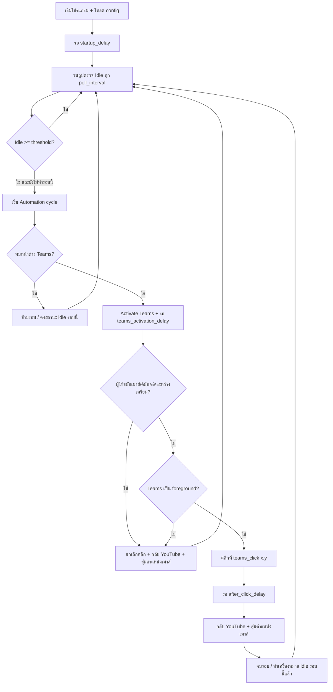

# YouTube Teams Auto Switch

แอปพลิเคชัน Python สำหรับ **Microsoft Windows** ที่ตรวจจับเวลา Idle ของผู้ใช้ แล้วสลับหน้าต่างระหว่าง **YouTube** (เบราว์เซอร์) กับ **Microsoft Teams** โดยอัตโนมัติ จากนั้นคลิกเมาส์หนึ่งครั้งในตำแหน่งที่กำหนดบน Teams แล้วสลับกลับ YouTube พร้อมย้ายตำแหน่งเมาส์แบบสุ่มภายในหน้าต่าง YouTube

## ความต้องการของระบบ

- Windows 10/11
- Python 3.10+
- เปิดหน้าต่าง YouTube (เช่น Chrome/Edge ที่มีคำว่า `YouTube` ในชื่อหน้าต่าง) และ Microsoft Teams ไว้ล่วงหน้า

## ติดตั้ง

```bash
python -m venv .venv
.venv\Scripts\activate
pip install -r requirements.txt
```

## การรัน

```bash
python main.py
```

ใช้ไฟล์คอนฟิก `config.yaml` (หรือระบุ `--config path/to/config.yaml`)

ดูตำแหน่งเมาส์ปัจจุบันเพื่อตั้งค่า `teams_click`:

```bash
python main.py --show-mouse-position
```

หยุดโปรแกรมด้วย `Ctrl+C`

## Flow การทำงาน



### รายละเอียด Automation cycle (หนึ่งรอบ)

1. **ค้นหา Teams** จาก `windows.teams.title_keywords`
2. **สลับไป Teams** และรอ `timing.teams_activation_delay_seconds`
3. **ตรวจสอบความปลอดภัย** — ถ้ามี input ของผู้ใช้ระหว่างเตรียมคลิก หรือ Teams ไม่ได้เป็น foreground จะยกเลิกคลิก
4. **คลิกเมาส์** ที่ `teams_click.x` / `teams_click.y` (ปุ่ม `left` / `right` / `middle`)
5. **รอ** `timing.after_click_delay_seconds`
6. **กลับ YouTube** จาก `windows.youtube.title_keywords`
7. **ย้ายเมาส์แบบสุ่ม** ภายในขอบหน้าต่าง YouTube (ถ้าเปิด `youtube_cursor.enabled`) โดยเว้นระยะจากขอบตาม `youtube_cursor.margin_pixels`

ขั้นตอนที่ 6–7 ทำงานทุกครั้งที่เรียก `_switch_back_to_youtube` (ทั้งรอบสำเร็จ ยกเลิก หรือข้ามคลิก) เพื่อให้กลับมาที่ YouTube ในลักษณะเดียวกัน

### Idle state

- หลังครบ threshold จะรัน automation **หนึ่งครั้งต่อหนึ่งช่วง idle** จนกว่าจะมี input ใหม่ของผู้ใช้
- การขยับเมาส์/คีย์บอร์ดระหว่างเตรียมคลิกจะ **ยกเลิก** คลิกในรอบนั้น (ไม่ถือว่าล้มเหลวถาวร)

## โครงสร้างโปรเจกต์

| ไฟล์ | หน้าที่ |
|------|--------|
| `main.py` | จุดเข้าโปรแกรม, CLI |
| `config.yaml` | ค่าตั้งค่าหลัก |
| `app/automation.py` | ลูป idle + cycle YouTube ↔ Teams |
| `app/idle_monitor.py` | อ่าน idle จาก Windows `GetLastInputInfo` |
| `app/window_manager.py` | ค้นหา/activate/ตรวจ foreground หน้าต่าง |
| `app/mouse_position.py` | คำนวณจุดสุ่มภายในสี่เหลี่ยมหน้าต่าง |
| `app/config_loader.py` | โหลดและ validate config |
| `keep_awake_mouse.py` | สคริปต์แยก (ขยับเมาส์ป้องกัน sleep) ไม่เกี่ยวกับ flow หลัก |

## การตั้งค่าสำคัญ (`config.yaml`)

| คีย์ | ความหมาย |
|------|----------|
| `activity_monitor.idle_threshold_seconds` | วินาที idle ก่อนเริ่ม cycle |
| `activity_monitor.poll_interval_seconds` | ความถี่ตรวจ idle |
| `timing.teams_activation_delay_seconds` | รอหลังเปิด Teams |
| `timing.after_click_delay_seconds` | รอหลังคลิกก่อนกลับ YouTube |
| `timing.youtube_activation_attempts` | จำนวนครั้งที่ลองสลับกลับ YouTube (สูงสุด 3 ในโค้ด) |
| `timing.youtube_activation_retry_delay_seconds` | หน่วงระหว่างแต่ละครั้งที่ลอง activate YouTube |
| `timing.youtube_activation_delay_seconds` | รอสั้นๆ ก่อนย้ายเมาส์ |
| `timing.youtube_restore_timeout_seconds` | จำกัดเวลา restore ทั้งชุด (กันโปรแกรมค้าง) |
| `windows.youtube.restore_minimize_teams` | ย่อ Teams ก่อนกลับ (ค่าเริ่มต้น `false`) |
| `teams_click.x` / `y` | พิกัดคลิกบนหน้าจอ |
| `youtube_cursor.enabled` | เปิด/ปิดการสุ่มตำแหน่งเมาส์หลังกลับ YouTube |
| `youtube_cursor.margin_pixels` | ระยะห่างจากขอบหน้าต่าง YouTube (พิกเซล) |

## ทดสอบ

ทดสอบที่รันบน Linux/macOS/Windows (ไม่ต้องมี Windows APIs):

```bash
python -m unittest discover -s tests -v
```

## หมายเหตุ

- ใช้ `pyautogui` สำหรับคลิกและย้ายเมาส์ — อย่าเลื่อนเมาส์ไปมุมซ้ายบนสุดของจอขณะรัน (PyAutoGUI failsafe)
- การย้ายเมาส์ด้วยโปรแกรมมัก **ไม่** นับเป็น user input ใน `GetLastInputInfo` แต่การคลิกหรือพิมพ์ของผู้ใช้จะรีเซ็ตช่วง idle ตามปกติ

## แก้ปัญหา: เปิด Teams แล้วไม่กลับ YouTube / ค้าง

1. ดู `logs/app.log` หลัง `Starting YouTube restore sequence` — จะมี attempt 1..N และชื่อ foreground ปัจจุบัน
2. ชื่อแท็บเบราว์เซอร์ต้องมีคำใน `windows.youtube.title_keywords` (เช่น `YouTube`, `Chrome`, `Edge`)
3. ค่าเริ่มต้น `windows.youtube.restore_minimize_teams: true` จะ **ย่อ Teams** ก่อนดึง YouTube กลับ (ช่วยเมื่อ Windows ไม่ให้ขโมยโฟกัส)
4. ก่อนสลับไป Teams แอปจะ **จำหน้าต่าง YouTube ที่เป็น foreground** อยู่แล้ว เพื่อใช้ handle เดิมตอนกลับ (ไม่พึ่งค้นหาชื่อใหม่เพียงอย่างเดียว)
5. รันโปรแกรมจากเทอร์มินัลใน session ที่ล็อกอินอยู่ (ไม่ใช่ Task Scheduler session แยก)
6. ถ้ายังไม่กลับ ลองเพิ่ม `timing.youtube_activation_attempts` เป็น `8`

## แก้ปัญหา: โปรแกรมค้าง / จอดำหลังกลับ YouTube

1. โค้ดล่าสุด **ไม่ใช้** `RedrawWindow`, `SwitchToThisWindow`, หรือ `AttachThreadInput` (มักทำให้ค้างกับ Chrome/Teams)
2. ขั้น restore มี **timeout** (`youtube_restore_timeout_seconds`, ค่าเริ่มต้น 6 วินาที) แล้วจบเสมอด้วย log `YouTube restore sequence finished`
3. ถ้าสลับกลับไม่ได้ ลอง `windows.youtube.restore_minimize_teams: true`
4. ถ้ากลับได้แต่จอดำ ลองเลื่อนเมาส์เองหนึ่งครั้ง หรือกด `k` ในหน้า YouTube (ขึ้นกับเบราว์เซอร์)
